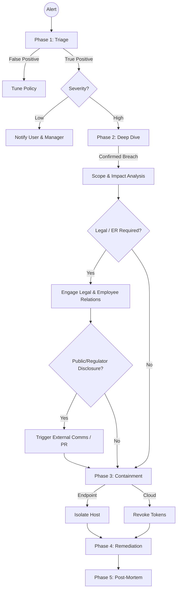

# Incident Response SOP: The "Kill Chain" Approach

## 1. The Incident Response Lifecycle (NIST 800-61)
This playbook adheres to the NIST standard: Preparation, Detection & Analysis, Containment, Eradication & Recovery, Post-Incident Activity.

## 2. Detailed Phase Actions

### Phase 1: Triage & Validation
**Objective:** Eliminate noise.
*   **Analyst Action:**
    *   View the "Snippet" (the captured data). Does it look like actual sensitive data?
    *   Check "Destination". Is it a known partner? (e.g., uploading to `partners.audit-firm.com`).
    *   **Tooling:** Use `log_analyzer.sh` to see if this is an isolated event or a spike.

### Phase 2: Investigation (Forensics)
**Objective:** Determine intent (Malicious vs. Negligent).
*   **Check List:**
    1.  **HR Status:** Is user serving notice?
    2.  **Web History:** Did they search for "how to bypass DLP" or "job sites"?
    3.  **File Operations:** Did they rename the file before upload? (e.g., `passwords.xlsx` -> `recipes.xlsx` is a huge red flag).
    4.  **USB History:** Have they used this USB device before?

### Phase 3: Containment strategies
*   **Soft Containment (Low Risk):**
    *   Encrypt the file on the USB stick remotely (if supported).
    *   Delete the shared link in OneDrive/Google Drive.
*   **Hard Containment (High Risk):**
    *   **Network Isolation:** Cut internet access to the laptop immediately.
    *   **Account Lockout:** Suspend Active Directory and SSO (Okta/Ping) access.

### Phase 4: Legal & Notification
*   If **>500 PII records** are confirmed lost:
    *   Engage Privacy Officer immediately (GDPR 72-hour clock starts).
    *   Preserve chain of custody for all logs.

## 3. Escalation Matrix
| Scenario | Primary Contact | SLA |
| :--- | :--- | :--- |
| **Accidental PII sharing** | User's Manager | 24 Hours |
| **Suspected Insider Threat** | HR & CISO | **1 Hour** |
| **Active Exfiltration (Live)** | SOC Lead | **15 Minutes** |
