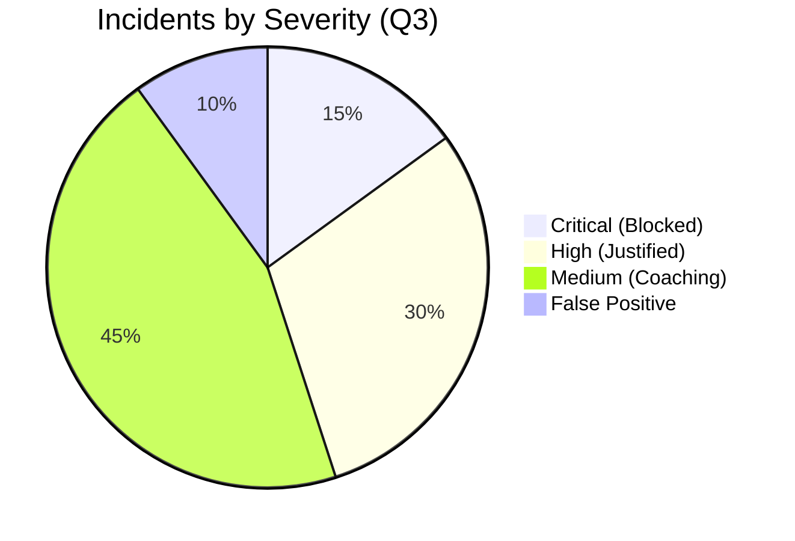

# CISO Dashboard: Risk & Efficiency Metrics

**Report Period:** Q3 2024
**Scope:** Global Enterprise (Endpoint, Cloud, Network)

## 1. Executive KPIs (The "Board Slide")

| Metric | Value | Change (YoY) | Context |
| :--- | :--- | :--- | :--- |
| **Data Retrieval Savings** | $2.4M | ⬆️ 12% | Estimated value of blocked source code exfiltration. |
| **Policy Coverage** | 98% | ⬆️ 5% | % of Assets with active DLP agents. |
| **Mean Time To Resolve** | 45 min | ⬇️ 20% | Improvement due to new SOAR playbooks. |

## 2. Trend Analysis

### Top 5 Exfiltration Channels
1.  **Direct Web Upload (Google Drive personal)** - *40% of blocks*
2.  **USB Mass Storage** - *25% of blocks* (Primarily Engineering)
3.  **Encrypted Archives (Password ZIPs)** - *15% of blocks*
4.  **Instant Messaging (Slack/WhatsApp)** - *10% of blocks*
5.  **Print/Fax** - *10% of blocks*

### User Behavior Analytics (UBA) Risk Score
*   **High Risk Users:** 12 identified this month.
*   *Definition:* Users with >3 blocks in 24 hours OR >10GB data movement.
*   **Action Taken:** 100% placed on "Watch List" (Full Screen Recording enabled).

## 3. Tool Efficacy (Optimization)
*   **False Positive Rate (FPR):** Currently at 3.2%.
*   **Target:** < 2.0%.
*   **Action Plan:** Adjusting "Credit Card" regex to require "Looking for 'CVV' keyword" to reduce noise from random number strings in log files.

## 4. Compliance Posture
*   [x] **GDPR**: 100% compliant on "Right to be Forgotten" implementation.
*   [x] **PCI-DSS**: Cardholder data scanning active on all File Shares.
*   [ ] **CCPA**: Tuning required for "California Resident" geo-location pattern.
